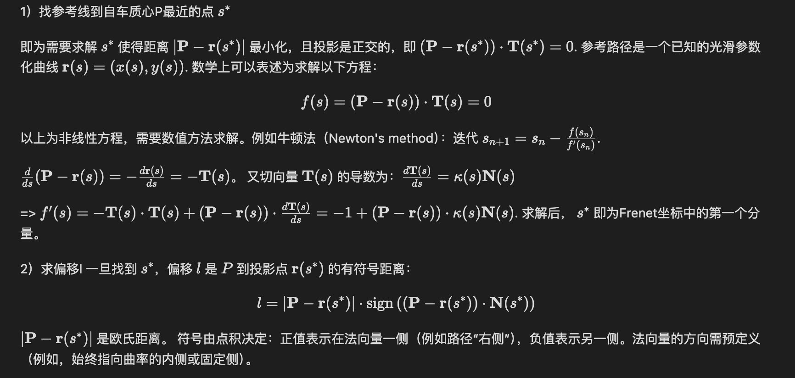

## Note
###  Mission planning
- 功能： start position， goal， lane graph + cost function ==> route planning ==> Route(sequence of lanes / road segments)
- cost function： could penalize lane changes， turns（left / right）， narrow lanes etc
#### 经典基于搜索算法
  - Dijkstra算法原理 single source shorted path。[算法图解](https://www.freecodecamp.org/chinese/news/dijkstras-shortest-path-algorithm-visual-introduction/)
  - A* 用启发式算法 f(n) = g(n) + h(n). where n is the next node on the path, g(n) is the cost of the path from the start node to n, and h(n) is a heuristic function that estimates the cost of the cheapest path from n to the goal. The heuristic function is problem-specific. If the heuristic function is admissible – meaning that it never overestimates the actual cost to get to the goal – A* is guaranteed to return a least-cost path from start to goal. 缺点：不满足运动学约束，难以做路径追踪
  - Hybrid A*： 改进A*难点。节点的拓展基于车辆运动学模型，cost计算基于grid map。 论文：
    - [Practical Search Techniques in Path Planning for Autonomous Driving](https://ai.stanford.edu/~ddolgov/papers/dolgov_gpp_stair08.pdf). 要旨：our hybrid-state A* is not guaranteed
to find the minimal-cost solution, due to its merging of
continuous-coordinate states that occupy the same cell in the
discretized space. However, the resulting path is guaranteed
to be drivable (rather than being piecewise-linear as in the
case of standard A*). Also, in practice, the hybrid-A* solution typically lies in the neighborhood of the global optimum, allowing us to frequently arrive at the globally optimal
solution via the second phase of our algorithmm (which usesg radient descent to locally improve the path）
    - [Medium paper reading note](https://medium.com/@junbs95/gentle-introduction-to-hybrid-a-star-9ce93c0d7869) 
    - Discretized search space, kinematics models (x, y, $\theta$)
    - Node Expansion: 1). In hybrid A*, a propagation of state $s_n$ = ($x_n$, $\theta_n$) opens new cells by simulating the kinematics. 2). cost_so_far g(s) is determined by length of the arc between $s_n$ and $s_{n+1}$. Can impose higher penalty on turning movement. 3). prune is needed when 2+ states share the same cell with the same angular bin. We remove the states if another state in the same discretization (same 2d cell and angle bin) has attained a less cost-so-far.
    - Heuristic h(s). Karl论中用max(unconstrained_cost_for_a_star, constrained_cost_for_a_star). unconstrained_cost 不考虑车辆动力学，只考虑能否到达的最短路径，会出现车辆横漂的路径；constraint_cost考虑车辆动力学，但可能出现沿着现有航向角驾驶撞墙的路径
    - Analytical expansion (a.k.a., shot to goal): We achieve an optimal solution if we can connect this best candidate directly to the goal without any collisions(Dubins or Reeds Shepp) path. It works in sparse regions, but not in dense spots. 
    - [Dubins path](https://en.wikipedia.org/wiki/Dubins_path), [Reeds Shepp](https://lavalle.pl/planning/node822.html). difference between the two is Reeds Shepp allows reverse motion
    - sample implementation
        - [KTH thesis](https://github.com/karlkurzer/path_planner) by Karlkurzer.
        - [nav2 (ROS2)](https://github.com/ros-navigation/navigation2/tree/main/nav2_smac_planner) by Samsung North America research
        - [Unity](https://github.com/Habrador/Self-driving-vehicle)
        - [Python](https://github.com/zhm-real/MotionPlanning)

<details>
<summary>Dijkstra algorithm</summary>

```
1   function Dijkstra(Graph, source):
2       Q ← Queue storing vertex priority
3       
4       dist[source] ← 0                          // Initialization
5       Q.add_with_priority(source, 0)            // associated priority equals dist[·]
6
7       for each vertex v in Graph.Vertices:
8           if v ≠ source
9               prev[v] ← UNDEFINED               // Predecessor of v
10              dist[v] ← INFINITY                // Unknown distance from source to v
11              Q.add_with_priority(v, INFINITY)
12
13
14      while Q is not empty:                     // The main loop
15          u ← Q.extract_min()                   // Remove and return best vertex
16          for each arc (u, v) :                 // Go through all v neighbors of u
17              alt ← dist[u] + Graph.Edges(u, v)
18              if alt < dist[v]:
19                  prev[v] ← u
20                  dist[v] ← alt
21                  Q.decrease_priority(v, alt)
22
23      return (dist, prev)

```
```c++
#include <iostream>
#include <vector>
#include <queue>
#include <limits> // For std::numeric_limits

const int INF = std::numeric_limits<int>::max();

// Structure to represent an edge
struct Edge {
    int to;
    int weight;
};

// Function to implement Dijkstra's algorithm
std::vector<int> dijkstra(int V, const std::vector<std::vector<Edge>>& adj, int src) {
    std::vector<int> dist(V, INF);
    std::priority_queue<std::pair<int, int>, std::vector<std::pair<int, int>>, std::greater<std::pair<int, int>>> pq;

    dist[src] = 0;
    pq.push({0, src}); // {distance, vertex}

    while (!pq.empty()) {
        int d = pq.top().first;
        int u = pq.top().second;
        pq.pop();

        // If a shorter path to u has already been found, skip
        if (d > dist[u]) {
            continue;
        }

        // Explore neighbors of u
        for (const Edge& edge : adj[u]) {
            int v = edge.to;
            int weight = edge.weight;

            // Relaxation step
            if (dist[u] + weight < dist[v]) {
                dist[v] = dist[u] + weight;
                pq.push({dist[v], v});
            }
        }
    }
    return dist;
}

int main() {
    int V = 5; // Number of vertices
    std::vector<std::vector<Edge>> adj(V);

    // Add edges to the graph
    adj[0].push_back({1, 10});
    adj[0].push_back({2, 3});
    adj[1].push_back({2, 1});
    adj[1].push_back({3, 2});
    adj[2].push_back({1, 4});
    adj[2].push_back({3, 8});
    adj[2].push_back({4, 2});
    adj[3].push_back({4, 5});

    int source = 0;
    std::vector<int> shortest_distances = dijkstra(V, adj, source);

    std::cout << "Shortest distances from source " << source << ":\n";
    for (int i = 0; i < V; ++i) {
        if (shortest_distances[i] == INF) {
            std::cout << "To vertex " << i << ": Unreachable\n";
        } else {
            std::cout << "To vertex " << i << ": " << shortest_distances[i] << "\n";
        }
    }

    return 0;
}
```
</details>

<details>
<summary>A* algorithm</summary>

```block
// from wiki
function reconstruct_path(cameFrom, current)
    total_path := {current}
    while current in cameFrom.Keys:
        current := cameFrom[current]
        total_path.prepend(current)
    return total_path

// A* finds a path from start to goal.
// h is the heuristic function. h(n) estimates the cost to reach goal from node n.
function A_Star(start, goal, h)
    // The set of discovered nodes that may need to be (re-)expanded.
    // Initially, only the start node is known.
    // This is usually implemented as a min-heap or priority queue rather than a hash-set.
    openSet := {start}

    // For node n, cameFrom[n] is the node immediately preceding it on the cheapest path from the start
    // to n currently known.
    cameFrom := an empty map

    // For node n, gScore[n] is the currently known cost of the cheapest path from start to n.
    gScore := map with default value of Infinity
    gScore[start] := 0

    // For node n, fScore[n] := gScore[n] + h(n). fScore[n] represents our current best guess as to
    // how cheap a path could be from start to finish if it goes through n.
    fScore := map with default value of Infinity
    fScore[start] := h(start)

    while openSet is not empty
        // This operation can occur in O(Log(N)) time if openSet is a min-heap or a priority queue
        current := the node in openSet having the lowest fScore[] value
        if current = goal
            return reconstruct_path(cameFrom, current)

        openSet.Remove(current)
        for each neighbor of current
            // d(current,neighbor) is the weight of the edge from current to neighbor
            // tentative_gScore is the distance from start to the neighbor through current
            tentative_gScore := gScore[current] + d(current, neighbor)
            if tentative_gScore < gScore[neighbor]
                // This path to neighbor is better than any previous one. Record it!
                cameFrom[neighbor] := current
                gScore[neighbor] := tentative_gScore
                fScore[neighbor] := tentative_gScore + h(neighbor)
                if neighbor not in openSet
                    openSet.add(neighbor)

    // Open set is empty but goal was never reached
    return failure
```
sample implementation 
- https://github.com/JDSherbert/A-Star-Pathfinding
- https://rosettacode.org/wiki/A*_search_algorithm#C++
</details>

#### 经典基于采样算法
- Cartesian 坐标系 x, y, $\theta_x$, $\kappa_x$, v, a， 横纵坐标， 航向角，曲率， 速度，加速度
- Frenet frame: The Frenet frame is defined relative to the reference path using two coordinates.
  - T (Tangent vector): Points in the direction of the reference path. $ |\mathbf{T}(s)| = 1 $
  - N (Normal vector): Points perpendicularly to the path, toward the center of curvature.
  - B (Binormal vector): A third axis for 3D applications, which is the cross-product of the tangent and normal vectors. 
  - 坐标系 S-L(S-t) s, $\dot{s}$, $\ddot{s}$, l, $l'$, $l''$。 纵向位移，纵向速度（对时间），纵向加速度（对时间），横向位移，横向速度（对纵向s导数），横向加速度（对纵向s导数）。坐标相对的是reference path
  - 不错的[visualization](https://github.com/fjp/frenet/blob/master/README.md)。frenet frame缺陷：当本身reference path 本身非常大的是时候（SF lombart street），当把运动投影到汽车本身(x,y)坐标系下，曲率仍然很大，controller 仍然难以跟踪参考轨迹。优点：中低曲率的reference path
- 两种坐标系换算关系
  - Cartesian -> Frenet $\mathbf{P}$ -> ($s^* $, l)
  - Frenet -> Cartesian $\mathbf{P} = \mathbf{r}(s) + l \cdot \mathbf{N}(s)$



<details>
<summary>推导 </summary>

1）找参考线到自车质心P最近的点 $ s^* $

即为需要求解 $ s^* $ 使得距离 $|\mathbf{P} - \mathbf{r}(s^*)|$ 最小化，且投影是正交的，即 $(\mathbf{P} - \mathbf{r}(s^*)) \cdot \mathbf{T}(s^*) = 0$. 参考路径是一个已知的光滑参数化曲线 $\mathbf{r}(s) = (x(s), y(s))$. 数学上可以表述为求解以下方程：
$$f(s) = (\mathbf{P} - \mathbf{r}(s)) \cdot \mathbf{T}(s) = 0$$
以上为非线性方程，需要数值方法求解。例如牛顿法（Newton's method）：迭代 $s_{n+1} = s_n - \frac{f(s_n)}{f'(s_n)}$. 

$\frac{d}{ds}(\mathbf{P} - \mathbf{r}(s)) = - \frac{d\mathbf{r}(s)}{ds} = - \mathbf{T}(s)$。
又切向量 $\mathbf{T}(s) $ 的导数为：$\frac{d\mathbf{T}(s)}{ds} = \kappa(s) \mathbf{N}(s)$

=> $ f'(s) = - \mathbf{T}(s) \cdot \mathbf{T}(s) + (\mathbf{P} - \mathbf{r}(s)) \cdot \frac{d\mathbf{T}(s)}{ds} = -1 + (\mathbf{P} - \mathbf{r}(s)) \cdot \kappa(s) \mathbf{N}(s)$.  求解后， $s^*$ 即为Frenet坐标中的第一个分量。

2）求偏移l
一旦找到 $ s^* $，偏移 $ l $ 是 $ P $ 到投影点 $ \mathbf{r}(s^*) $ 的有符号距离：
$$l = |\mathbf{P} - \mathbf{r}(s^*)| \cdot \operatorname{sign} \left( (\mathbf{P} - \mathbf{r}(s^*)) \cdot \mathbf{N}(s^*) \right)$$

$ |\mathbf{P} - \mathbf{r}(s^*)| $ 是欧氏距离。
符号由点积决定：正值表示在法向量一侧（例如路径“右侧”），负值表示另一侧。法向量的方向需预定义（例如，始终指向曲率的内侧或固定侧）。 
</details>


<details>
<summary>python code </summary>

```python
import numpy as np
from scipy.optimize import fsolve

# reference path r(s) = [s * cos(s), s * sin(s)]
def r(s):
    return np.array([s * np.cos(s), s * np.sin(s)])

def T(s):  
    # Tangent vector
    ds = 1e-6
    dr_ds = (r(s + ds) - r(s - ds)) / (2 * ds)
    return dr_ds / np.linalg.norm(dr_ds)

def f(s, P):
    # s is passed in as array
    if isinstance(s, np.ndarray):
        s = s[0]
    return np.dot(P - r(s), T(s))

def N(s):
    T_s = T(s)
    # normal vector N = 90 degree rotation of T
    return np.array([-T_s[1], T_s[0]])  

# Ego position
P = np.array([1.0, 1.0])
s_guess = 0.0 
s_star = fsolve(f, s_guess, args=(P,))[0]


T_star = T(s_star)
# # normal vector N = 90 degree rotation of T
N_star = N(s_star)
offset_vec = P - r(s_star)
l = np.linalg.norm(offset_vec) * np.sign(np.dot(offset_vec, N_star))

print(f"Frenet s = {s_star:.3f}, l = {l:.3f}")

def frenet_to_cartesian(s, l):
    r_s = r(s)
    N_s = N(s)
    P = r_s + l * N_s
    return P

P = frenet_to_cartesian(s_star, l)
print(f"{P=}"

```

</details>


